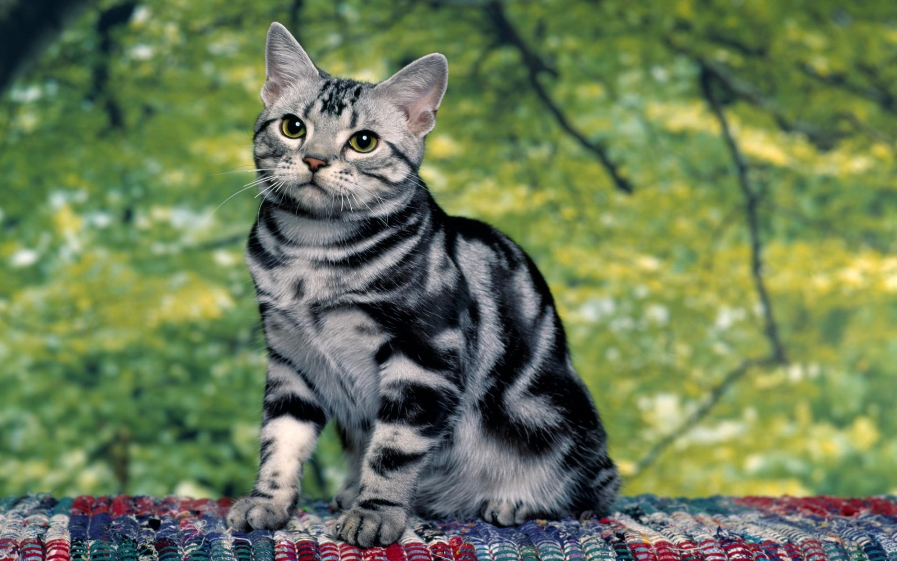

# Hints for Markdown 

## Штрифты

Mo*the*r

*Курсив*

~~Зачеркнутый~~

<u>Подчеркнутый</u>

**Полужирный**

***Жирный курсив***

## Списки


 1. Молоко
 2. Мясо 
     * курица
     - говядина
     + свинина
 3. Все равно третий пункт

## Цитаты и/или красивое выделение текста

```sh
i love you
```

> LALALA
>> OLOLO


## WEB ссылки

https://www.youtube.com


[youtube](https://www.youtube.com/ "Видеохостинг")

## Картинки

[koshka](https://w.forfun.com/fetch/a9/a9cd07f219cf102dcda5ccff4acde0b5.jpeg/ "милая мордашка")



